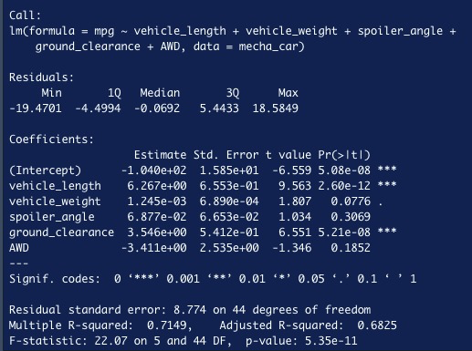
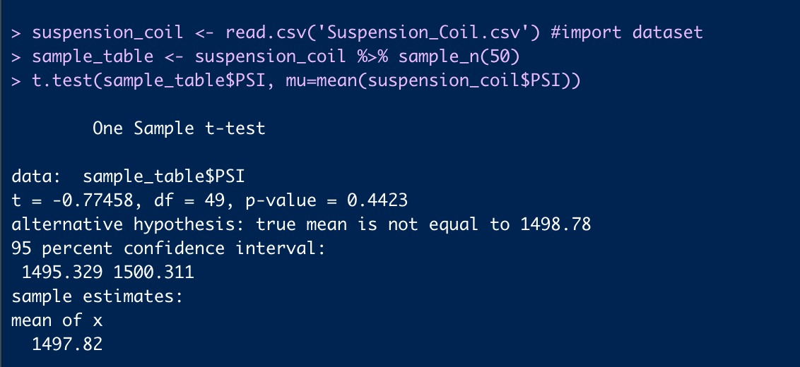
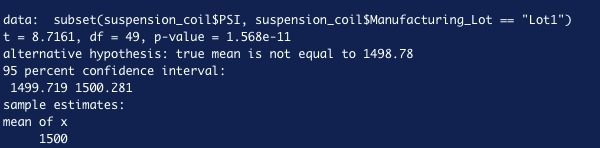
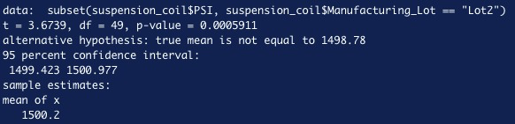
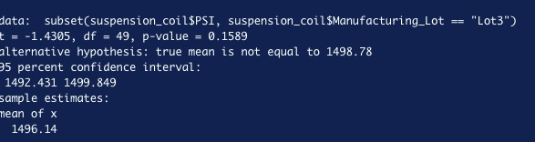

# MechaCar_Statistical_Analysis

## Linear Regression to Predict MPG
Multiple linear regression was performed using multiple variables to predict the mpg of MechaCar prototypes using multiple variables. We used lm() function in R for the model . We then get the p value and R squared value using the summary function in R

Our P-value is 5.35e-11. Since this is less than 0.05, we will reject the null hypothesis that the slope is 0 and state there is correlation. We also have 71percent from our R-squared which denotes the accuracy of the model

### Which variables/coefficients provided a non-random amount of variance to the mpg values in the dataset?

The variables that provided non-random amount of variance are intercept, ground clearance and vehicle length. The p-values are less than 0.05 and as a result unlikely to provide random amounts of variance in our model

### Is the slope of the linear model considered to be zero? Why or why not?

No the slope is not zero. Our null hypothesis is to assume the slope is zero. Since we have our p-value less than 0.05, we can say this is not statistically significant and reject the null hypothesis

### Does this linear model predict mpg of MechaCar prototypes effectively? Why or why not?**

Yes, we have a 71percent accuracy from our R squared score
 
## Summary Statistics on Suspension Coils

Our Second analysis was on suspension coils. We read the data using R function and used summarize () function to get highlevel detail metrics including mean, median, variance and standard deviation. For below, we can see the mean of the datafarame is 1498.78 and the variance is approximately 62

We also employed the use of group by function along with summarize() to group each manufacturing lot by mean, median, variance and standard deviation. Below image shows our result

Our total meets the design specifications as our total variance is 62 and the current limit is 100. Our lots 1 and 2 also met with the requirement with variances below 100

## T-Tests on Suspension Coils

T-tests was also performed to check if PSI across all manufacturing lots are statistically different from our population mean. Our P-value is 0.4423 which is higher than 0.05. This as result shows that we cannot reject the hypothesis that there is no statistical difference 

We also discovered looking at lot 1 and lot 2 separately that our p-value was less than 0.05, we as a result can reject the null hypothesis that there is no statistical difference. The population data and lot 1 are statically different 

Lot 3 has a higher p value than 0.05. This means that we cannot reject our null hypothesis that there is no statistical difference. Lot 3 and the population data are statistically similar

## Study Design: MechaCar vs Competition

In this statistical study I would compare car sale prices by model/year for Mecha vs their largest competitor to see how competitive their pricing is to their competitor. 

### What metric or metrics are you going to test?

We consider the cost price of each car sold at Mecha versus its competition. We would examine the mean price per car model and year for Mecha and its competitor

### What is the null hypothesis or alternative hypothesis?

The NULL hypothesis will be that the cost per car model per year is not higher than its competitors. While our alternative hypothesis will be that the cost per model is higher than its competitors

### What statistical test would you use to test the hypothesis? And why? 

I will use a paired t test for this test as this will give us opportunity to compare two different datasets between each observation; mean cost per model per year

### What data is needed to run the statistical test? 

The data to use in this situation will be cost, model and year for both Mecha Car and their competitor

